# Motor Fraud Analytics Platform
## End-to-end data, modelling, scoring & operational delivery

**Knowledge-transfer presentation / system design skeleton**

> A reusable, client-neutral architecture for documenting a batch motor-fraud solution.

---

## 1. Executive story

The solution is designed as a **daily, production-oriented fraud decisioning pipeline**:

**Operational data → governed ingestion → transformation → feature construction → two-stage fraud modelling → scoring → referral strategy → operational delivery → feedback & KPI tracking**

The architecture deliberately separates:

- **Data engineering** — ingestion, storage, transformations and batch orchestration
- **Data science** — feature validation, modelling, calibration and model artefacts
- **ML engineering** — reusable model architecture, versioning and scoring
- **Business decisioning** — referral thresholds, capacity and business rules
- **Operations** — daily file exchange, manual enrichment and downstream workflow
- **Monitoring** — model performance, referrals, outcomes and business KPIs

---

## 2. How to use this deck

This document is intended to serve simultaneously as:

1. **Knowledge-transfer material** for developers and data scientists
2. **System documentation** for maintainers
3. **Architecture reference** for future models
4. **Presentation material** for technical and business audiences
5. **A reusable blueprint** for extending the platform to other analytical models

### Visual language

Use the same colour semantics throughout:

| Colour variable | Purpose |
|---|---|
| `--c-primary` | Architecture / platform |
| `--c-secondary` | Data movement / engineering |
| `--c-accent` | ML / analytics |
| `--c-highlight` | Human decision / manual action |
| `--c-alert` | Exceptions / risk / failure |

**Theme customisation:** change only the variables in the front-matter CSS block.

---

## 3. System at a glance

```mermaid
flowchart LR
    A[Internal operational data] --> B[SAS data platform]
    X[External intelligence] --> B
    B --> C[Daily extraction / subsetting]
    C --> D[Secure file transfer]
    D --> E[Cloud landing / Blob]
    E --> F[Fabric Lakehouse]
    F --> G[Batch activation]
    G --> H[Reusable ETL / SRC scripts]
    H --> I[Motor Fraud dataset]
    I --> J[Feature validation]
    J --> K[Two-stage fraud model]
    K --> L[Daily scoring]
    L --> M[Referral strategy]
    M --> N[Operational export]
    N --> O[Case-management workflow]
    O --> P[Investigator feedback]
    P --> Q[KPI / monitoring]
    Q --> K
```

<div class="placeholder">

**IMAGE PLACEHOLDER — SYSTEM ARCHITECTURE**

Insert the final internal architecture screenshot here.

Suggested asset: `01_end_to_end_architecture.png`

</div>

---

## 4. Operating principle

The platform follows a **batch-first, traceable and reusable** design.

### Daily lifecycle

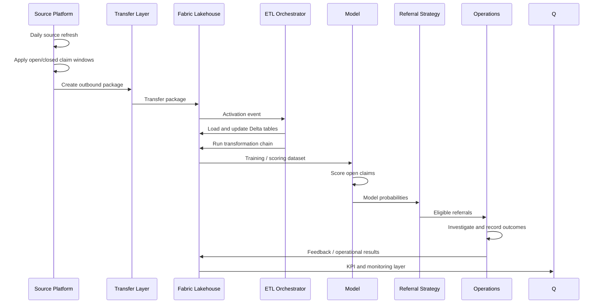

---

# Data Architecture

## 5. Source ecosystem

The analytical environment combines several categories of data.

### Internal sources

- Claim details
- Claiming / policy information
- Postcode and mapping information
- Work items
- Events and logs
- Circumstances
- Suspicious-agent / internal lists
- Business rules
- Damage information
- Vehicle information
- Other operational source sections

### External intelligence

- Cross-industry fraud intelligence
- Claims-history data
- Vehicle history
- Vehicle inspection / test history
- Industry datasets
- Census data
- Other open-source datasets

The important architectural point is that **external datasets do not necessarily arrive with the same timing, granularity, coverage or matching mechanism**.

---

## 6. Data arrival and entity matching

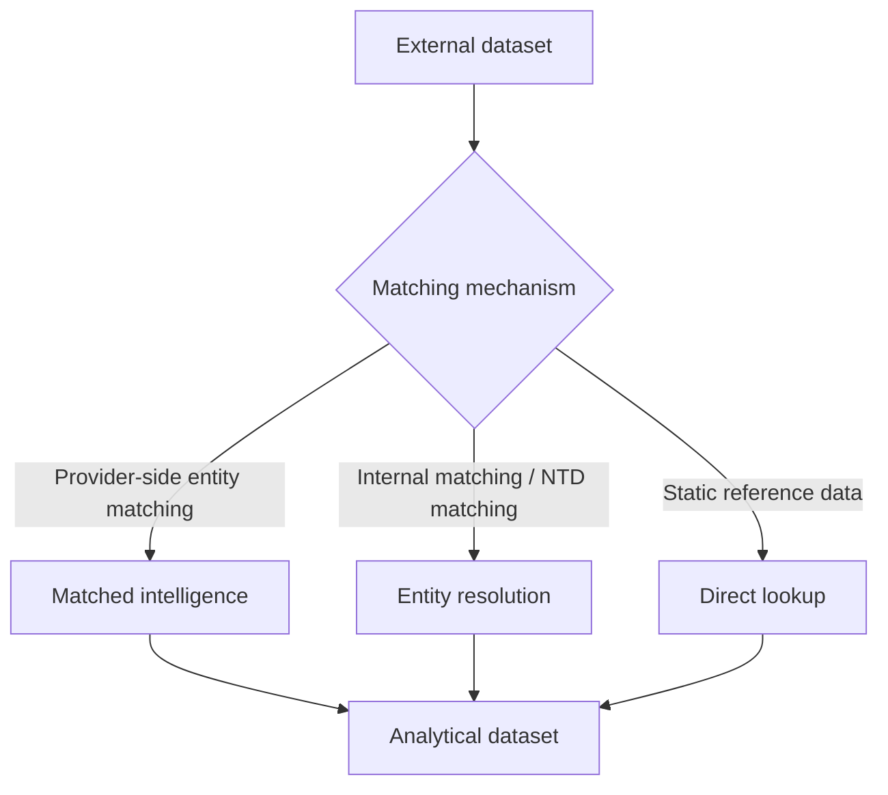

### Design implication

The modelling layer should not assume that every feature is available:

- for every claim,
- at FNOL,
- at the same timestamp,
- at the same entity level,
- or through the same ingestion route.

This is one of the main reasons for the **two-stage modelling approach**.

---

## 7. Daily source-to-Lakehouse movement

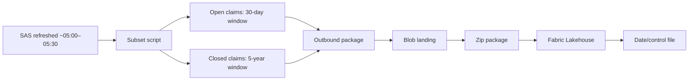

### Windowing logic

| Dataset purpose | Window |
|---|---|
| **Open claims** | Last 30 days |
| **Closed claims** | Last 5 years |
| **Open claims** | Used for daily scoring |
| **Closed claims** | Used for modelling |

The windows are a **modelling and operational design choice**, not simply a storage optimisation.

---

## 8. Control-file driven activation

A lightweight control mechanism is used to determine whether the daily package has actually changed.

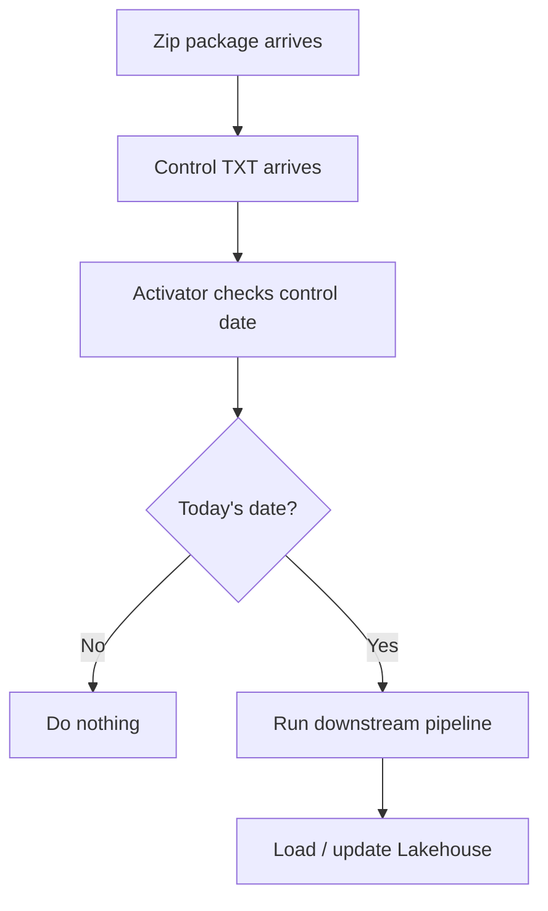

### Why this matters

The control file acts as a simple **batch readiness signal**.

It avoids relying only on the presence of a file whose name may be overwritten repeatedly.

---

## 9. Lakehouse ingestion and Delta updates

The Lakehouse acts as the analytical mirror of the source dataset.

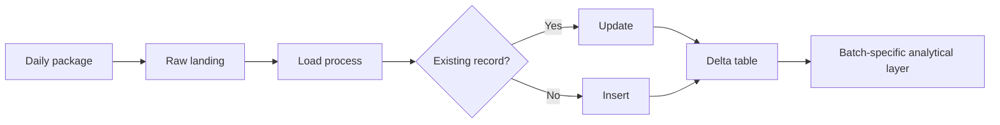

### Core principle

**Update + insert** behaviour is implemented through Delta tables so that the analytical environment can be maintained incrementally rather than rebuilt unnecessarily.

---

# Data Engineering

## 10. Reusable transformation architecture

Instead of creating one large transformation script, the solution uses **small, purpose-specific processing scripts**.

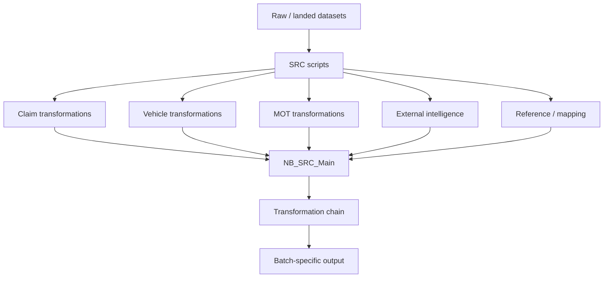

### Why this structure?

It makes the pipeline:

- easier to test,
- easier to debug,
- easier to extend,
- easier to review,
- easier to reuse across future models.

---

## 11. Batch ID as the traceability key

Every pipeline run is associated with a **unique batch ID**.

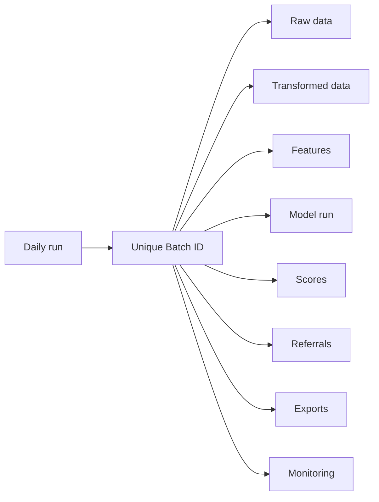

The batch ID becomes the **common reference passed through the platform**.

This supports:

- reproducibility,
- auditability,
- troubleshooting,
- comparison of runs,
- lineage across data and model outputs.

---

## 12. Example transformation pattern

A transformation should answer one clearly defined question.

### Example: vehicle history

Raw MOT history may contain multiple observations per vehicle.

The processing layer can derive features such as:

- previous test history,
- previous outcomes,
- historical mileage patterns,
- recency-based measures,
- vehicle-level summaries.

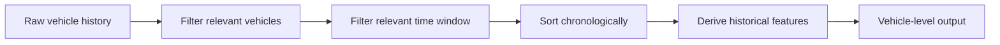

**Important:** the transformation layer preserves the source grain where appropriate; aggregation into the final modelling grain happens deliberately during feature construction.

---

# Analytical Data Model

## 13. Grain is a first-class design decision

Different source tables naturally exist at different levels.

| Data | Typical grain |
|---|---|
| Claim | Claim |
| Claim circumstances | Claim |
| Vehicle | Vehicle |
| Vehicle history | Vehicle × event |
| External intelligence | Varies |
| Model output | Claim |

The final analytical dataset must therefore explicitly manage:

**source grain → transformation grain → modelling grain → scoring grain**

---

## 14. Analytical merge

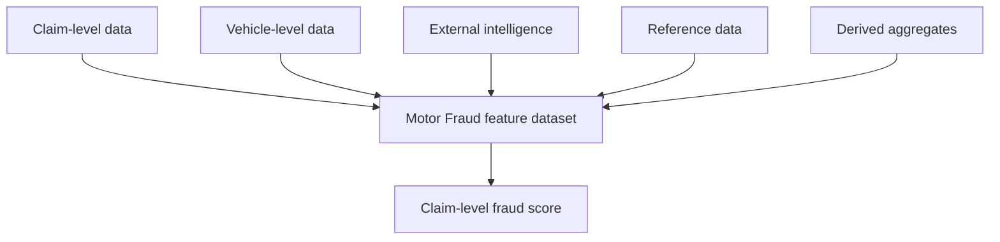

### Design rule

Do not silently change the grain during early-stage ETL.

Make aggregation and joins explicit so that:

- duplication can be detected,
- leakage can be investigated,
- feature lineage remains understandable,
- model outputs remain aligned to the business decision unit.

---

# Modelling Strategy

## 15. Why a two-stage fraud model?

The fraud types have materially different base rates.

The solution therefore considers:

- **Accident**
- **Fire**
- **Theft**

A single modelling strategy can be distorted when substantially different event types are treated as if they have identical prevalence and information availability.

### Initial approach

Separate models were considered for individual fraud types.

### Problem

Fire and theft contain substantially fewer observations than accident.

This creates:

- data sparsity,
- unstable search / modelling behaviour,
- weaker statistical support,
- potentially inefficient use of the available internal dataset.

### Adopted direction

A **two-stage architecture** separates the broad behavioural signal from incremental external intelligence.

---

## 16. Two-stage architecture

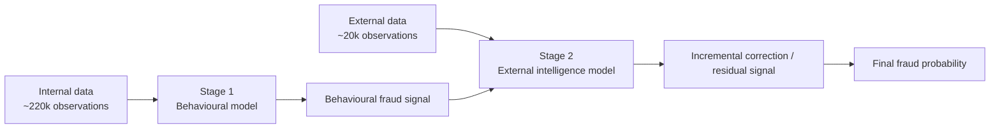

### Concept

**Stage 1** learns from broadly available internal behavioural information.

**Stage 2** uses the subset of claims for which external intelligence is available to learn the incremental correction associated with that intelligence.

This allows the solution to use the larger internal dataset without forcing the external model to pretend that external data exists for every observation.

---

## 17. FNOL-first thinking

The model is designed around the principle that useful fraud intelligence should be available as early as possible.

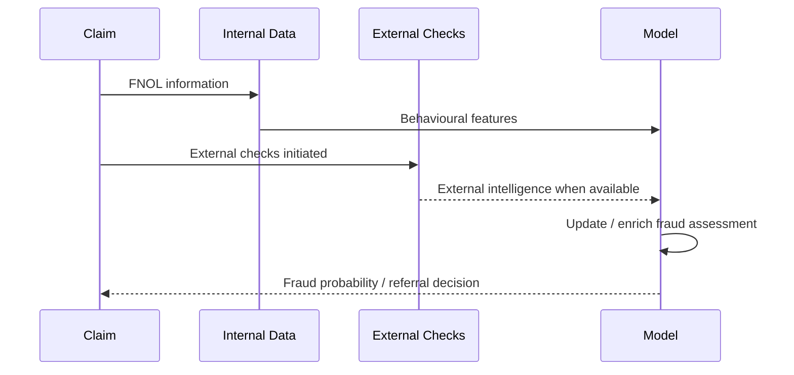

### Data timing is part of the model design

External intelligence may arrive:

- on the same day,
- after a few days,
- later in the claim lifecycle,
- or not at all.

The architecture therefore needs to support **partial availability and later enrichment**.

---

## 18. Feature validation before modelling

A dedicated validation layer sits before the model.

Key checks include:

- Information Value (IV)
- Weight of Evidence (WoE)
- feature usefulness
- potential leakage
- unexpected distributions
- missingness
- data quality

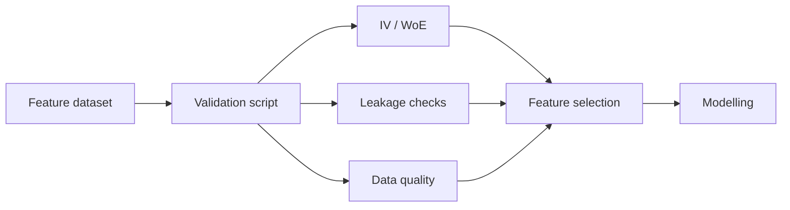

The validation layer is deliberately separated from the modelling code so that feature quality can be assessed before model training.

---

## 19. Model architecture

The model stack uses a reusable custom architecture around automated model selection.

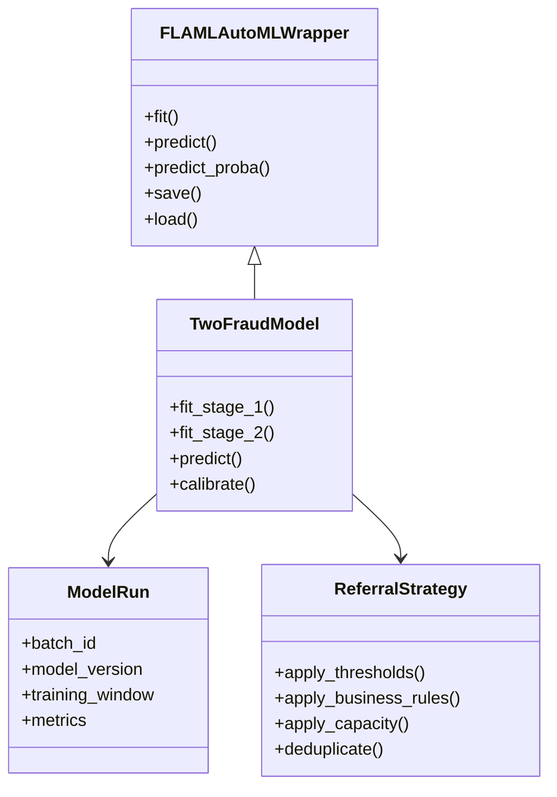

---

## 20. Calibration and probability quality

The model output is used as a **probability**, not merely as a ranking.

Calibration is therefore an important part of the model pipeline.

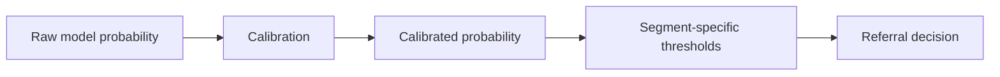

### Key principle

A probability threshold should be interpreted relative to:

- model calibration,
- segment,
- fraud type,
- business capacity,
- referral cost,
- expected value.

---

# ML Engineering

## 21. Model lifecycle and MLflow

Every model run should be traceable.

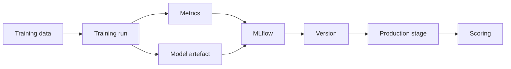

The operational benefit is that a model can be loaded by **version / stage**, rather than depending on an informal file-copy convention.

---

## 22. Training versus scoring

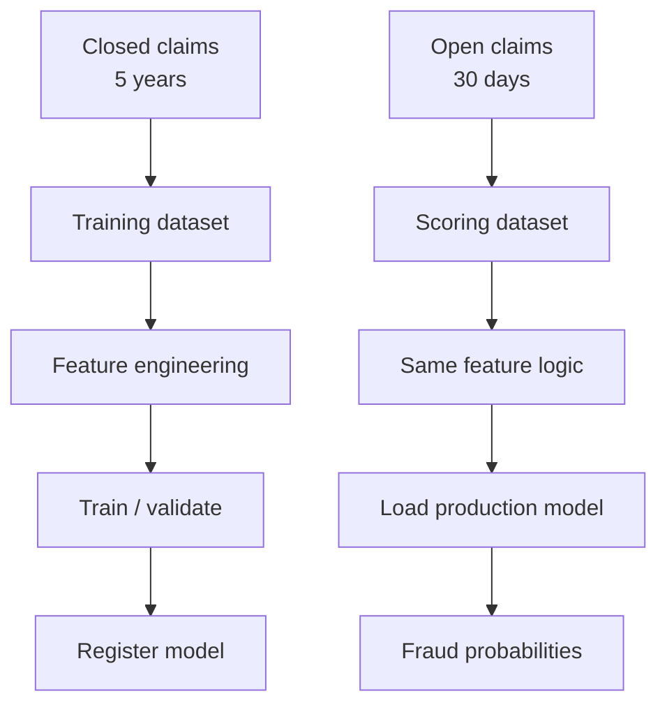

### Separation of concerns

**Training** asks:

> What patterns distinguish historical outcomes?

**Scoring** asks:

> Given the current claim information, what is the estimated fraud probability?

---

# Referral & Business Decisioning

## 23. Model probability is not the referral decision

The model produces a score.

The business needs a **manageable work queue**.

Therefore:

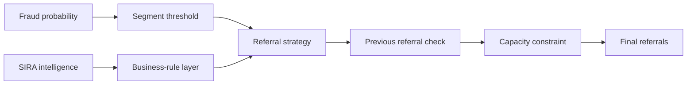

---

## 24. Segment-specific thresholds

The solution uses different thresholds for different segments.

Illustrative structure:

| Segment | Medium | High |
|---|---:|---:|
| Accident | Segment-specific | Segment-specific |
| Fire | Segment-specific | Segment-specific |
| Theft | Segment-specific | Segment-specific |

The important principle is **not to assume one universal probability threshold** across materially different event types.

---

## 25. Referral strategy

A referral may be generated when one or more conditions are met.

Examples of decision signals:

- high model probability,
- medium model probability,
- high external intelligence score,
- relevant business rule,
- claim not previously referred,
- capacity remains available.

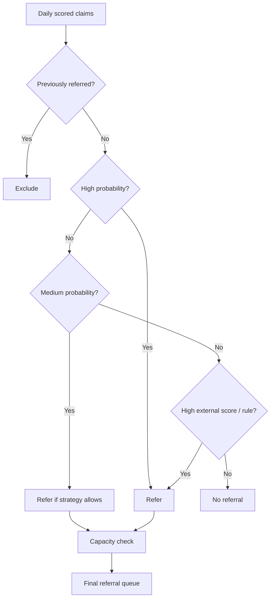

---

## 26. Capacity-aware decisioning

The referral strategy is intentionally a **bridge between ML and operations**.

If the investigation team can process only a defined number of claims, the system should not blindly output every eligible case.


This makes the system configurable without changing the underlying model.

---

# Operational Integration

## 27. Daily production timeline

```mermaid
timeline
    title Illustrative daily operating cycle
    05:00 : Source refresh
    05:30 : Data available for transfer
    06:00 : Lakehouse update + insert
    06:00–08:00 : External intelligence / manual enrichment window
    08:00 : Main scoring and referral pipeline
    08:00+ : Export and downstream delivery
    Later : Investigation and feedback
```

---

## 28. Manual external-data bridge

One external intelligence source remains partially manual.

The architecture reduces the burden by producing the required query automatically.

```mermaid
flowchart LR
    A[Daily claim batch] --> B[Generate query]
    B --> C[SharePoint]
    C --> D[User receives notification]
    D --> E[Run query in external web tool]
    E --> F[Download result]
    F --> G[Upload to destination folder]
    G --> H[Pipeline consumes result]
```

### Design philosophy

The manual step is isolated rather than distributed throughout the pipeline.

This makes future automation easier because the **interface boundary is explicit**.

---

## 29. Failure and fallback behaviour

External intelligence may be delayed or unavailable.

The pipeline therefore supports a soft fallback:

```mermaid
flowchart TD
    A[Daily pipeline] --> B{External intelligence available?}
    B -->|Yes| C[Use current external data]
    B -->|No| D[Use latest available / fallback data]
    C --> E[Continue scoring]
    D --> E
    E --> F[Referral strategy]
```

The underlying principle is that external enrichment is valuable, but the entire operational pipeline should not become unusable solely because a non-deterministic external source is delayed.

---

# Delivery Architecture

## 30. Export and downstream workflow

```mermaid
flowchart LR
    A[Final referrals] --> B[Export layer]
    B --> C[Excel output]
    C --> D[Copy / transfer jobs]
    D --> E[SharePoint]
    E --> F[Downstream operational platform]
    F --> G[Investigator workflow]
    G --> H[Feedback]
```

The spreadsheet is an **integration boundary**, not the analytical source of truth.

This distinction is important because spreadsheet-based transfer can introduce:

- date-format issues,
- schema changes,
- type conversion,
- manual handling risk,
- duplicated records.

---

# Monitoring & Business Value

## 31. KPI framework

The monitoring layer should connect technical model metrics to business outcomes.

### Operational KPIs

- Number of claims scored
- Number of referrals
- Referral rate
- High / medium referral mix
- Capacity utilisation
- Processing success / failure
- Pipeline latency

### Fraud / business KPIs

- Confirmed fraud captures
- Fraud capture rate
- Referral-to-fraud conversion
- Estimated value captured
- False-positive burden
- Outcome by fraud type

### Model KPIs

- Calibration
- Discrimination metrics
- Segment stability
- Feature drift
- Score distribution
- Missingness / data-quality changes

---

## 32. KPI flow

```mermaid
flowchart LR
    A[Model scores] --> B[Referral metrics]
    B --> C[Investigation outcomes]
    C --> D[Fraud outcomes]
    D --> E[Business value]
    A --> F[Model monitoring]
    F --> G[Data / model drift]
    E --> H[Management reporting]
    G --> H
```

<div class="placeholder">

**IMAGE PLACEHOLDER — KPI DASHBOARD**

Insert Power BI / dashboard screenshot here.

Suggested asset: `10_kpi_dashboard.png`

</div>

---

# Platform Engineering

## 33. Naming and coding standards

The platform should use consistent conventions across:

- notebooks,
- scripts,
- folders,
- tables,
- batch IDs,
- model versions,
- exported files.

### Recommended conceptual structure

```text
/
├── src/
│   ├── scripts/
│   │   ├── claims/
│   │   ├── vehicles/
│   │   ├── external/
│   │   └── reference/
│   └── NB_SRC_Main
│
├── models/
│   ├── training/
│   ├── scoring/
│   └── referral/
│
├── batches/
│   └── <batch_id>/
│
├── monitoring/
└── exports/
```

---

## 34. Adding a new transformation

The intended developer workflow is simple:

1. Locate the relevant source / transformation folder.
2. Add or modify the dedicated processing script.
3. Keep the transformation focused on one responsibility.
4. Register it in the main orchestration chain.
5. Validate output grain and schema.
6. Run feature validation.
7. Test downstream model compatibility.
8. Record the change through the normal version-control process.

```mermaid
flowchart LR
    A[Developer change] --> B[Dedicated SRC script]
    B --> C[Main orchestration]
    C --> D[Batch output]
    D --> E[Validation]
    E --> F[Model compatibility]
    F --> G[Production]
```

---

# Observability

## 35. Pipeline event model

Every major stage should emit a success / failure signal.

```mermaid
flowchart LR
    A[Ingestion] --> B[Transformation]
    B --> C[Feature build]
    C --> D[Validation]
    D --> E[Model]
    E --> F[Scoring]
    F --> G[Referral]
    G --> H[Export]

    A -.-> Z[Event / log]
    B -.-> Z
    C -.-> Z
    D -.-> Z
    E -.-> Z
    F -.-> Z
    G -.-> Z
    H -.-> Z
```

### Minimum logging fields

- batch ID
- timestamp
- pipeline stage
- status
- row counts
- duration
- error message
- model version
- input/output location

---

# Security & Governance

## 36. Data governance principles

The architecture should preserve clear boundaries between:

- source systems,
- analytical storage,
- model artefacts,
- operational outputs,
- monitoring data.

### Key controls

- Minimise sensitive data movement.
- Keep access scoped by role.
- Maintain batch-level lineage.
- Version model artefacts.
- Avoid embedding credentials in notebooks.
- Separate development and production assets.
- Record manual intervention points.
- Treat exported files as controlled interfaces.

---

# Reusable Platform

## 37. Extending the architecture to future models

The most valuable outcome is not only one fraud model.

It is a reusable analytical platform.

```mermaid
flowchart TB
    A[Shared data architecture]
    A --> B[Motor Fraud]
    A --> C[Personal Injury Propensity]
    A --> D[Personal Injury Fraud]
    A --> E[Future analytical models]

    B --> F[Model-specific features]
    C --> G[Model-specific features]
    D --> H[Model-specific features]
    E --> I[Model-specific features]

    F --> J[Shared deployment / monitoring patterns]
    G --> J
    H --> J
    I --> J
```

---

## 38. What stays common?

Across future models, the following can remain largely reusable:

- source ingestion,
- Lakehouse structure,
- batch IDs,
- Delta update patterns,
- orchestration,
- data-quality controls,
- feature processing framework,
- model registry,
- scoring framework,
- export mechanisms,
- KPI infrastructure,
- operational logging.

---

## 39. What changes by model?

Model-specific components may include:

- target definition,
- modelling grain,
- feature engineering,
- aggregation logic,
- model architecture,
- calibration strategy,
- referral thresholds,
- business KPIs,
- feedback interpretation.

### Example

A personal-injury model may operate at a different analytical grain than motor fraud.

Therefore:

> **Reuse the platform; do not force every model into the same data shape.**

---

# Architecture Principles

## 40. Design principles

### 1. Separate data engineering from modelling

Data preparation should be reusable independently of a specific model.

### 2. Preserve data grain until aggregation is intentional

Unexpected duplication is one of the easiest ways to corrupt a model.

### 3. Treat time as a feature of the data architecture

Availability at FNOL matters as much as statistical usefulness.

### 4. Make batch ID the common lineage key

A batch should be traceable from ingestion to business outcome.

### 5. Separate probability from decision

The model estimates risk; referral strategy converts risk into operational action.

### 6. Build for partial availability

External data will not always arrive at the same time.

### 7. Prefer reusable components

A future model should reuse the platform rather than duplicate it.

---

# Knowledge Transfer

## 41. Developer onboarding path

A new developer should be able to understand the system in this order:

```mermaid
flowchart TD
    A[Business problem] --> B[End-to-end architecture]
    B --> C[Data sources]
    C --> D[Batch / Lakehouse]
    D --> E[SRC transformations]
    E --> F[Analytical dataset]
    F --> G[Feature validation]
    G --> H[Model architecture]
    H --> I[Scoring]
    I --> J[Referral strategy]
    J --> K[Operational export]
    K --> L[Monitoring]
```

---

## 42. Suggested documentation hierarchy

```text
01_Executive_Overview.md
02_System_Architecture.md
03_Data_Architecture.md
04_Data_Engineering.md
05_Feature_Engineering.md
06_Model_Architecture.md
07_ML_Engineering.md
08_Scoring_and_Referral.md
09_Operational_Runbook.md
10_Monitoring_and_KPIs.md
11_Troubleshooting.md
12_Future_Models.md
```

The presentation can act as the **front door** to this deeper documentation.

---

# Image & Diagram Placeholders

## 43. Recommended visual assets

Use internal screenshots selectively.

| ID | Recommended visual |
|---|---|
| `IMG-01` | End-to-end architecture |
| `IMG-02` | Source-system landscape |
| `IMG-03` | SAS → Blob → Lakehouse pipeline |
| `IMG-04` | Fabric workspace / notebook structure |
| `IMG-05` | Batch folder / batch-ID example |
| `IMG-06` | Feature validation output |
| `IMG-07` | Model architecture |
| `IMG-08` | MLflow model registry |
| `IMG-09` | Referral strategy example |
| `IMG-10` | KPI dashboard |
| `IMG-11` | Operational workflow |
| `IMG-12` | Future-model architecture |

---

## 44. Placeholder convention

For the final presentation, replace:

```text
<div class="placeholder">
  IMAGE PLACEHOLDER
</div>
```

with:

```markdown

```

Keep all images in a dedicated folder:

```text
project/
├── presentation.md
├── images/
│   ├── 01_architecture.png
│   ├── 02_data_flow.png
│   ├── 03_model.png
│   └── 04_dashboard.png
└── docs/
```

---

# Final System View

## 45. One-slide architecture summary

```mermaid
flowchart LR
    A[Operational + External Data]
    --> B[Source Refresh]
    --> C[Secure Transfer]
    --> D[Lakehouse]
    --> E[Reusable ETL]
    --> F[Feature Dataset]
    --> G[Validation]
    --> H[Two-Stage Model]
    --> I[Calibrated Scores]
    --> J[Referral Strategy]
    --> K[Operational Queue]
    --> L[Investigation]
    --> M[Outcome + KPI]
    --> H
```

### The complete story

**Reliable data movement** enables **reliable feature engineering**.

Reliable feature engineering enables **robust modelling**.

Robust modelling enables **calibrated scoring**.

Calibrated scoring becomes valuable only when combined with **business decisioning and operational capacity**.

Operational outcomes then create the feedback required to **monitor and improve the system**.

---

# Appendix A — Runbook Skeleton

## 46. Daily runbook

### Before run

- Confirm source refresh completed.
- Confirm control file date.
- Confirm expected package exists.
- Confirm previous run status.

### During run

- Monitor Lakehouse ingestion.
- Monitor transformation chain.
- Validate row counts.
- Confirm feature dataset created.
- Confirm model loaded successfully.
- Confirm scoring completed.
- Confirm referral strategy completed.

### External enrichment

- Confirm query file generated.
- Confirm manual external check completed.
- Confirm result file uploaded.
- Confirm data consumed by pipeline.

### After run

- Confirm export created.
- Confirm downstream transfer completed.
- Confirm notification sent.
- Confirm batch status recorded.
- Confirm KPI data updated.

---

# Appendix B — Troubleshooting matrix

## 47. Common failure modes

| Symptom | Likely area | First check |
|---|---|---|
| No pipeline trigger | Activation | Control-file date |
| Missing data | Transfer | Blob / Lakehouse landing |
| Row count unexpectedly low | ETL | Source window / filters |
| Duplicate claims | Join logic | Grain / keys |
| Missing external data | Manual bridge | Destination folder |
| Model cannot load | MLflow | Version / production stage |
| Too many referrals | Decisioning | Threshold / capacity |
| No referrals | Decisioning | Eligibility conditions |
| Export rejected | Interface | Schema / date formats |
| KPI mismatch | Monitoring | Batch ID / outcome mapping |

---

# Appendix C — Architecture checklist

## 48. Before production

- [ ] Source refresh is monitored
- [ ] Batch ID is generated
- [ ] Control-file mechanism is working
- [ ] Lakehouse update + insert is validated
- [ ] Transformation chain is deterministic
- [ ] Data grain is documented
- [ ] Leakage checks are implemented
- [ ] Feature validation is complete
- [ ] Model is registered
- [ ] Model version is traceable
- [ ] Calibration is validated
- [ ] Scoring window is correct
- [ ] Referral thresholds are approved
- [ ] Capacity logic is tested
- [ ] Previous referrals are excluded
- [ ] Export schema is validated
- [ ] Manual enrichment fallback is tested
- [ ] KPI pipeline is operational
- [ ] Failure notifications are tested

---

# Appendix D — Future evolution

## 49. Potential evolution path

### Near term

- Strengthen monitoring
- Improve data-quality checks
- Automate remaining manual enrichment
- Expand KPI reporting
- Improve feedback classification

### Medium term

- Introduce more model-specific reusable components
- Improve drift monitoring
- Improve model retraining governance
- Reduce spreadsheet-based interfaces

### Longer term

- Event-driven enrichment
- Automated external-data retrieval where permitted
- Real-time or near-real-time decisioning where justified
- Unified model platform for multiple insurance analytics use cases

---

# Closing

## 50. The platform is bigger than the model

The core achievement is not simply a fraud probability model.

It is an **operational analytical system** that connects:

**data → engineering → machine learning → decisioning → operations → outcomes**

That distinction is important.

A model that cannot reliably receive data, produce traceable scores, respect operational capacity, deliver decisions, and learn from outcomes is not yet a production decisioning system.

This architecture is designed to make those layers explicit, modular and reusable.

---

## Presenter note

> **Recommended talk track:** start with the business problem, show the one-slide architecture, then progressively zoom into data, modelling, ML engineering, referral strategy, operations and monitoring. Finish by showing how the same platform can support future analytical models.
