<!-- _class: hero -->

# Motor Fraud Analytics Platform

## End-to-end data, machine learning, decisioning & operational delivery

**Version 2 — Technical architecture story**

A reusable, client-neutral blueprint for knowledge transfer, system documentation and technical presentation.

<!--
Speaker notes:
Open by explaining that this is not only a model walkthrough.
The story is an end-to-end production analytical system: data enters,
becomes features, becomes a model signal, becomes an operational decision,
and eventually produces outcomes and monitoring feedback.
-->

---

<!-- _class: hero -->

# The case study in one sentence

> **Turn heterogeneous, time-dependent claim and external intelligence into a calibrated, capacity-aware daily fraud referral workflow.**

The design separates:

**Data engineering → Data science → ML engineering → Decisioning → Operations → Monitoring**

<!--
Speaker notes:
Use this slide to establish the narrative before showing architecture.
-->

---

<!-- _class: case-study -->

# Single-slide case study — quick look

<div class="two-col">

<div class="card">

### Business problem

- Motor fraud signals differ materially by event type.
- Internal and external datasets arrive at different times.
- External intelligence is available only for a subset of observations.
- Operations has finite investigation capacity.
- A model score alone is not an operational decision.

</div>

<div class="card">

### Solution

- Daily source refresh and controlled transfer.
- Lakehouse-based analytical mirror.
- Modular, batch-ID-driven transformations.
- Stage 1 behavioural model using broad internal data.
- Stage 2 external-intelligence correction.
- Calibration + segment-specific thresholds.
- Capacity-aware referral strategy.
- Operational export + feedback + KPI monitoring.

</div>

</div>

<div class="three-col">

<div class="accent-card"><strong>~220k</strong><br><span class="small">internal observations referenced in the design</span></div>
<div class="accent-card"><strong>~20k</strong><br><span class="small">external-enriched observations referenced in the design</span></div>
<div class="accent-card"><strong>30 days</strong><br><span class="small">open-claim scoring window</span></div>

</div>

<div class="takeaway"><strong>Architecture thesis:</strong> keep the broad internal signal reusable, add external intelligence incrementally, and separate probability estimation from operational referral.</div>

<!--
Speaker notes:
This is the executive quick-look slide. Do not explain every component.
Use it as the 60-second summary for someone who only has time for one slide.
Numbers are from the project description and should be replaced if the final
validated counts differ.
-->

---

<!-- _class: divider -->

<div class="section-number">01 · EXECUTIVE STORY</div>

# From data movement to business decision

## One production pipeline, multiple engineering disciplines

<!--
Speaker notes:
Section transition. The next slides explain the architecture before drilling into implementation.
-->

---

# 1. The problem is larger than the model

<div class="three-col">

<div class="card problem">

### Problem

Heterogeneous source systems, different data grains and asynchronous external enrichment.

</div>

<div class="card problem">

### Problem

Fraud event types have different prevalence and therefore different statistical behaviour.

</div>

<div class="card problem">

### Problem

The investigation team needs a manageable queue, not an unbounded list of scores.

</div>

</div>

<div class="takeaway">

**The production challenge is the integration of data, modelling and operational decisioning — not model training in isolation.**

</div>

---

# 2. Design response: separate the layers

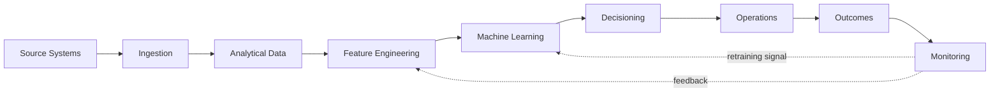

<div class="legend">
<span>● Data</span>
<span>● Platform</span>
<span>● ML</span>
<span>● Decisioning</span>
<span>● Feedback</span>
</div>

<div class="takeaway"><strong>Design principle:</strong> each layer has a clear responsibility and a controlled interface to the next layer.</div>

---

# 3. 30-second summary — executive architecture

<div class="four-col">

<div class="card"><h3>Data</h3>Operational + external intelligence are brought into a governed analytical environment.</div>

<div class="card"><h3>Science</h3>Feature validation and a two-stage modelling approach convert data into fraud probability.</div>

<div class="card"><h3>Decisioning</h3>Probability, external intelligence, business rules and capacity become referrals.</div>

<div class="card"><h3>Learning</h3>Operational outcomes become KPI and model-monitoring signals.</div>

</div>

<div class="takeaway">The architecture is intentionally reusable for future analytical models with different targets and grains.</div>

---

<!-- _class: divider -->

<div class="section-number">02 · DATA ARCHITECTURE</div>

# Make data availability explicit

## The model can only use information that exists when the decision is made.

<!--
Speaker notes:
This is a key conceptual transition. The timing of data availability is one of the reasons
the modelling architecture is structured as it is.
-->

---

<!-- _class: hero -->

# Data availability drives model architecture

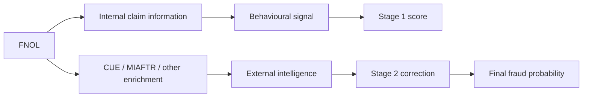

### Core idea

**Feature availability is a modelling constraint, not merely an ETL concern.**

<!--
Speaker notes:
Explain that some information is available at FNOL, while other intelligence may arrive later.
The architecture therefore supports an early behavioural assessment and later enrichment.
-->

---

# 5. Data availability timeline


<div class="two-col">

<div class="card">
<strong>Early availability</strong><br>
Claim circumstances, damage, vehicle and other internal information can support the initial behavioural signal.
</div>

<div class="card">
<strong>Asynchronous availability</strong><br>
Cross-industry or external intelligence can arrive later and should be incorporated without assuming complete coverage.
</div>

</div>

---

# 6. Source ecosystem

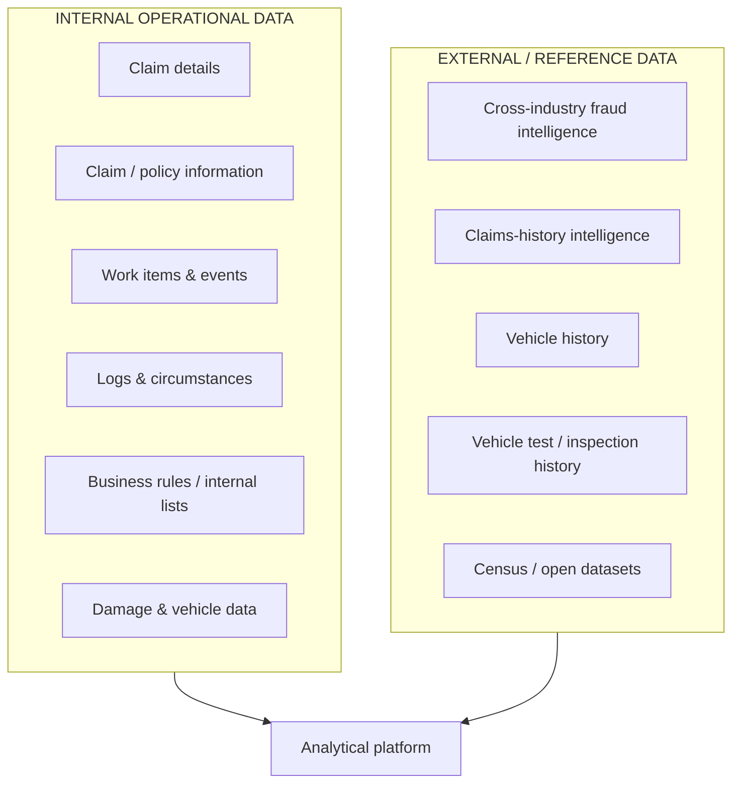

### Matching matters

External data can require provider-side matching, internal entity resolution, or direct reference lookup.

---

# 7. Problem → decision → benefit: source integration

<div class="three-col">

<div class="card problem">
<h3>Problem</h3>
External datasets have different coverage, matching mechanisms, timing and grains.
</div>

<div class="card decision">
<h3>Decision</h3>
Treat each source as an explicit ingestion / transformation component rather than forcing a single arrival pattern.
</div>

<div class="card benefit">
<h3>Benefit</h3>
New sources can be added without redesigning the entire modelling pipeline.
</div>

</div>

---

# 8. Daily source-to-Lakehouse flow

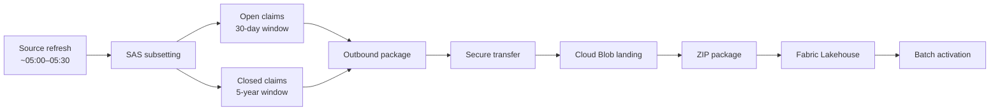

<div class="placeholder">IMAGE PLACEHOLDER — replace with internal source → Blob → Lakehouse architecture screenshot</div>

<!--
Speaker notes:
The times are illustrative from the supplied project description. Keep them configurable
if the production schedule changes.
-->

---

# 9. Control-file-driven activation

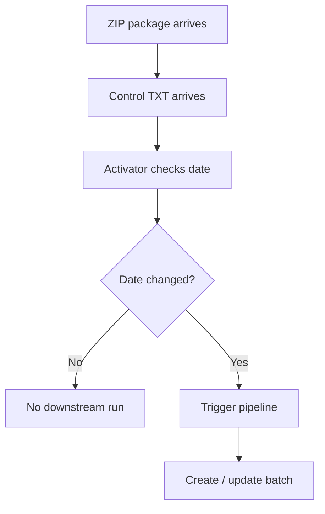

### Why use a control signal?

The package filename can be overwritten. The control file provides a simple, explicit **readiness indicator**.

<div class="takeaway">A small control mechanism prevents a large downstream dependency on ambiguous file state.</div>

---

# 10. Lakehouse update + insert

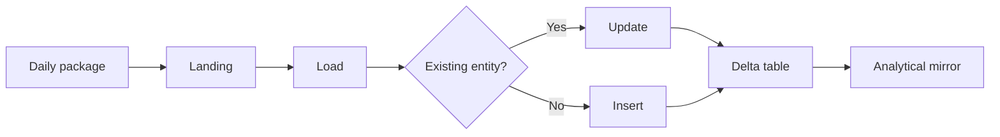

### Design intent

The Lakehouse provides a persistent analytical representation of the refreshed source data while supporting incremental processing.

---

# 11. Batch ID is the lineage spine

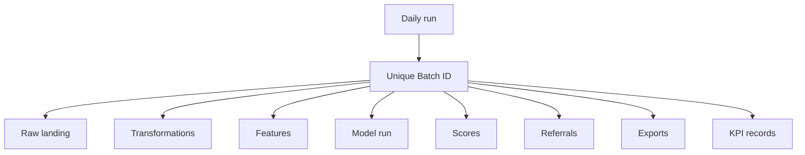

<div class="takeaway">

**If a production issue occurs, the first question should be: “Which batch ID produced this?”**

</div>

---

# 12. 30-second summary — data architecture

- The source platform remains the operational data origin.
- The Lakehouse provides the analytical boundary.
- Control files determine batch readiness.
- Delta tables support incremental update + insert.
- Batch IDs provide end-to-end traceability.
- Modular transformations protect the platform from source complexity.

---

<!-- _class: divider -->

<div class="section-number">03 · DATA ENGINEERING</div>

# Build transformations as reusable components

## Keep the pipeline understandable before making it clever.

---

# 13. Modular transformation architecture

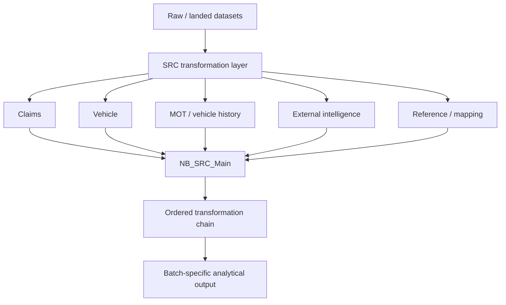

### One transformation should have one clear responsibility.

---

# 14. Problem → decision → benefit: modular ETL

<div class="three-col">

<div class="card problem">
<h3>Problem</h3>
A single monolithic transformation notebook becomes difficult to test, extend and debug.
</div>

<div class="card decision">
<h3>Decision</h3>
Create focused source-specific transformation scripts and orchestrate them centrally.
</div>

<div class="card benefit">
<h3>Benefit</h3>
Developers can add or change one transformation without rewriting the whole pipeline.
</div>

</div>

---

# 15. Example: vehicle-history feature construction

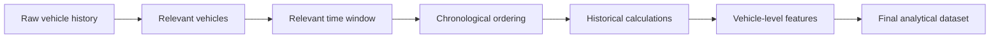

Examples of derived concepts include:

- previous test outcomes,
- historical mileage patterns,
- recency,
- count / frequency measures,
- vehicle-level historical summaries.

---

# 16. Data grain is a first-class design decision

| Dataset | Typical grain | Design consideration |
|---|---|---|
| Claim | Claim | Decision unit |
| Claim circumstances | Claim | Time-sensitive |
| Vehicle | Vehicle | Join carefully |
| Vehicle history | Vehicle × event | Aggregate deliberately |
| External intelligence | Varies | Coverage / matching |
| Final score | Claim | Operational output |

<div class="takeaway">Do not allow joins to silently change the analytical grain.</div>

---

# 17. Analytical merge

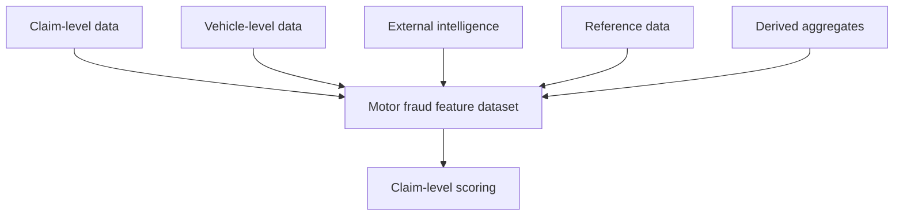

### Required controls

**Keys → join cardinality → row counts → missingness → duplicate detection → final grain**

---

# 18. 30-second summary — data engineering

The engineering layer should make the modelling layer **boring**.

That means:

- deterministic transformations,
- explicit grains,
- reproducible batch outputs,
- modular scripts,
- consistent naming,
- controlled schemas,
- observable failures.

---

<!-- _class: divider -->

<div class="section-number">04 · DATA SCIENCE</div>

# Why the model is two-stage

## Statistical design follows data availability and business prevalence.

---

<!-- _class: hero -->

# Why two stages?

<div class="three-col">

<div class="card problem">
<h3>1 · Data coverage</h3>
External intelligence exists for only a subset of the broader internal population.
</div>

<div class="card problem">
<h3>2 · Different prevalence</h3>
Accident, fire and theft have materially different event / fraud rates.
</div>

<div class="card problem">
<h3>3 · Timing</h3>
External intelligence may arrive after FNOL.
</div>

</div>

<div class="takeaway"><strong>Design response:</strong> learn the broad behavioural signal first, then model incremental external intelligence where it exists.</div>

<!--
Speaker notes:
This is the conceptual heart of the model architecture. Pause here.
The two-stage design is a response to coverage, prevalence and timing constraints.
-->

---

# 19. Stage 1 — behavioural model

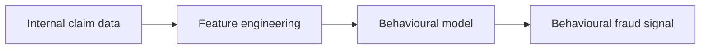

### Purpose

Capture broad behavioural information that is available across the larger internal population.

The stage is designed to avoid throwing away the majority of usable historical observations simply because external enrichment is incomplete.

---

# 20. Stage 2 — external intelligence model

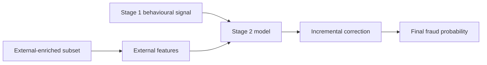

### Concept

The second stage learns the incremental information contained in external intelligence **over and above the broad behavioural signal**.

---

# 21. Two-stage model journey

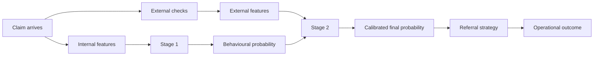

<div class="takeaway">The model journey mirrors the information journey.</div>

---

# 22. Model journey — one claim

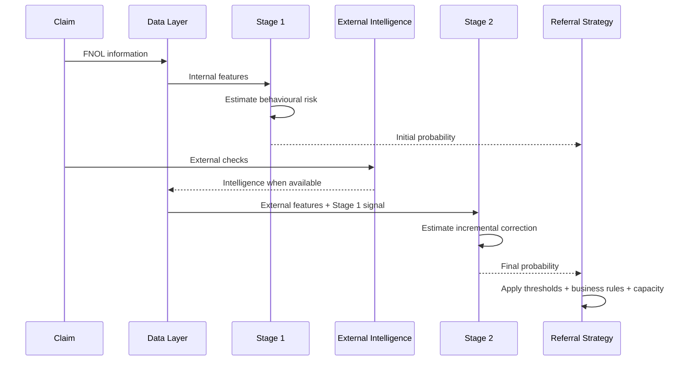

---

# 23. Feature validation before modelling

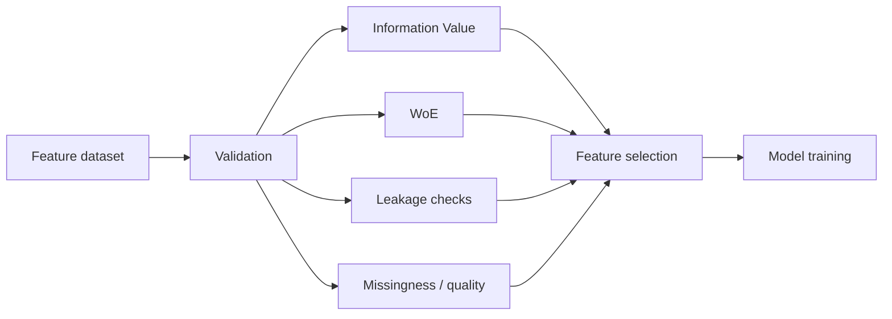

### Why this stage exists

Feature validation provides an independent checkpoint before automated model search.

---

# 24. 30-second summary — data science

- Model architecture reflects data availability.
- Event types should not automatically share identical modelling assumptions.
- Stage 1 uses the broad internal population.
- Stage 2 captures incremental external intelligence.
- Feature validation sits before automated model search.
- Calibration matters because probabilities drive downstream thresholds.

---

<!-- _class: divider -->

<div class="section-number">05 · ML ENGINEERING</div>

# Turn statistical models into production assets

## Reproducibility, versioning and scoring consistency are part of the model.

---

<!-- _class: hero -->

# Dedicated ML engineering architecture

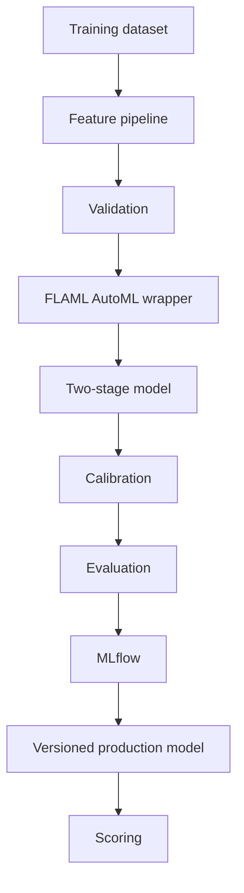

<div class="takeaway">The model is treated as a deployable artefact, not merely a notebook output.</div>

---

# 25. Model class architecture

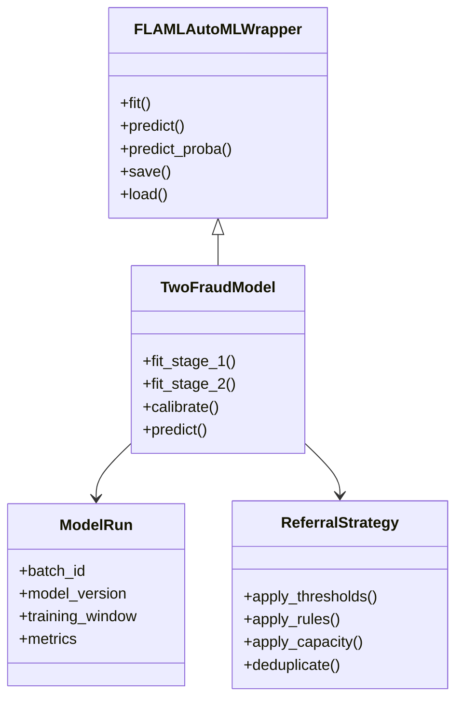

---

# 26. Training lifecycle


### Training and scoring use different populations but should share the same feature logic.

---

# 27. MLflow model lifecycle

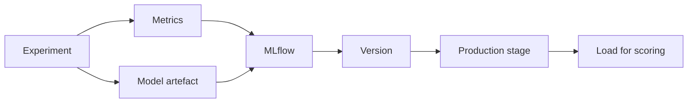

<div class="placeholder">IMAGE PLACEHOLDER — insert internal MLflow/model-registry screenshot</div>

---

# 28. Scoring lifecycle

```mermaid
flowchart LR
    A[Open claims<br/>last 30 days] --> B[Feature engineering]
    B --> C[Load production model]
    C --> D[Stage 1]
    D --> E[Stage 2 where available]
    E --> F[Calibrated probability]
    F --> G[Referral strategy]
```

### Critical invariant

**Training and scoring must use compatible feature definitions and transformations.**

---

# 29. 30-second summary — ML engineering

A production model requires:

**reproducible features + versioned artefact + calibrated probability + traceable model run + consistent scoring**

The engineering architecture makes those properties explicit.

---

<!-- _class: divider -->

<div class="section-number">06 · DECISIONING</div>

# Probability is not a referral

## Convert model output into a manageable operational queue.

---

# 30. Probability → decision

```mermaid
flowchart LR
    A[Model probability] --> B[Segment]
    B --> C[Threshold]
    D[External intelligence score] --> E[Business rules]
    C --> F[Referral strategy]
    E --> F
    F --> G[Previous referral check]
    G --> H[Capacity]
    H --> I[Final queue]
```

<div class="takeaway">The referral strategy is the bridge between statistical output and operational action.</div>

---

# 31. Problem → decision → benefit: referral strategy

<div class="three-col">

<div class="card problem">
<h3>Problem</h3>
A model may produce more eligible cases than the investigation team can process.
</div>

<div class="card decision">
<h3>Decision</h3>
Combine probability, external intelligence, business rules, deduplication and capacity.
</div>

<div class="card benefit">
<h3>Benefit</h3>
The business receives a controllable, prioritised work queue rather than raw model output.
</div>

</div>

---

# 32. Segment-specific thresholds

| Segment | Medium threshold | High threshold | Rationale |
|---|---:|---:|---|
| Accident | Configurable | Configurable | Different base rate / behaviour |
| Fire | Configurable | Configurable | Different base rate / behaviour |
| Theft | Configurable | Configurable | Different base rate / behaviour |

**Do not hard-code a universal threshold when segment distributions differ.**

---

# 33. Referral decision tree

```mermaid
flowchart TD
    A[Daily scored claims] --> B{Previously referred?}
    B -->|Yes| C[Exclude]
    B -->|No| D{High probability?}
    D -->|Yes| E[Candidate]
    D -->|No| F{Medium probability?}
    F -->|Yes| G[Candidate]
    F -->|No| H{High external score / rule?}
    H -->|Yes| E
    H -->|No| I[No referral]
    G --> J[Capacity]
    E --> J
    J --> K[Final referrals]
```

---

# 34. Capacity-aware decisioning

```mermaid
flowchart LR
    A[Eligible referrals] --> B[Prioritise]
    B --> C[Capacity limit]
    C --> D[Operational queue]
```

### Why make capacity configurable?

Operational capacity changes independently of model development.

The referral layer should therefore allow business users to change queue constraints without retraining the underlying model.

---

# 35. 30-second summary — decisioning

**Model:** estimates probability.

**External intelligence:** adds additional evidence.

**Business rules:** encode explicit decision logic.

**Capacity:** limits operational workload.

**Referral strategy:** combines them into an actionable queue.

---

<!-- _class: divider -->

<div class="section-number">07 · OPERATIONS & INTEGRATION</div>

# Engineer for the real operating environment

## Automation should isolate — not hide — manual steps.

---

# 36. Daily production timeline

```mermaid
timeline
    title Illustrative production cycle
    05:00 : Source refresh
    05:30 : Data available for transfer
    06:00 : Lakehouse update + insert
    06:00–08:00 : External enrichment window
    08:00 : Main scoring / referral pipeline
    08:00+ : Export and downstream delivery
    Later : Investigation and feedback
```

<div class="small muted">Times are based on the supplied project description and should be updated if the production schedule changes.</div>

---

# 37. Manual external-data bridge

```mermaid
flowchart LR
    A[Daily batch] --> B[Generate query]
    B --> C[SharePoint / destination]
    C --> D[User notification]
    D --> E[Run external web query]
    E --> F[Download result]
    F --> G[Upload result]
    G --> H[Pipeline consumes result]
```

### Design principle

The manual action is reduced to a **small, explicit interface boundary** rather than being embedded throughout the analytical pipeline.

---

# 38. Failure and fallback

```mermaid
flowchart TD
    A[Daily pipeline] --> B{External data available?}
    B -->|Yes| C[Use current intelligence]
    B -->|No| D[Use approved fallback / latest available data]
    C --> E[Score]
    D --> E
    E --> F[Referral]
```

### Why?

External intelligence can arrive asynchronously. A delayed external source should not automatically make the entire operational pipeline unusable.

---

# 39. Export architecture

```mermaid
flowchart LR
    A[Final referrals] --> B[Export layer]
    B --> C[Excel interface]
    C --> D[Transfer]
    D --> E[SharePoint / destination]
    E --> F[Operational platform]
    F --> G[Investigation]
    G --> H[Feedback]
```

<div class="takeaway">The spreadsheet is an integration boundary, not the analytical source of truth.</div>

---

# 40. 30-second summary — operations

The production system is designed around a simple operating rhythm:

**Refresh → ingest → enrich → transform → score → refer → investigate → measure**

The remaining manual step is deliberately isolated so it can be automated later without redesigning the entire platform.

---

<!-- _class: divider -->

<div class="section-number">08 · MONITORING & BUSINESS VALUE</div>

# Close the loop

## A production system needs outcome visibility.

---

# 41. KPI framework

<div class="three-col">

<div class="card">
<h3>Operational</h3>
<ul>
<li>Claims scored</li>
<li>Referrals</li>
<li>Referral rate</li>
<li>Capacity utilisation</li>
<li>Pipeline latency</li>
</ul>
</div>

<div class="card">
<h3>Model</h3>
<ul>
<li>Calibration</li>
<li>Discrimination</li>
<li>Score distribution</li>
<li>Segment stability</li>
<li>Data drift</li>
</ul>
</div>

<div class="card">
<h3>Business</h3>
<ul>
<li>Fraud captures</li>
<li>Referral conversion</li>
<li>Estimated value captured</li>
<li>False-positive burden</li>
<li>Outcome by fraud type</li>
</ul>
</div>

</div>

---

# 42. KPI flow from model to business value

```mermaid
flowchart LR
    A[Model scores] --> B[Referral metrics]
    B --> C[Investigation outcomes]
    C --> D[Fraud outcomes]
    D --> E[Business value]

    A --> F[Model monitoring]
    F --> G[Data / model drift]

    E --> H[Management reporting]
    G --> H
```

<div class="placeholder">IMAGE PLACEHOLDER — insert Power BI / KPI dashboard screenshot</div>

---

# 43. Pipeline observability

```mermaid
flowchart LR
    A[Ingestion] --> B[Transformation]
    B --> C[Feature build]
    C --> D[Validation]
    D --> E[Model]
    E --> F[Scoring]
    F --> G[Referral]
    G --> H[Export]

    A -.-> Z[Central logging]
    B -.-> Z
    C -.-> Z
    D -.-> Z
    E -.-> Z
    F -.-> Z
    G -.-> Z
    H -.-> Z
```

### Minimum logging contract

`batch_id · timestamp · stage · status · row_count · duration · error · model_version`

---

# 44. 30-second summary — monitoring

The system should answer four questions every day:

1. **Did the pipeline run?**
2. **Did we score the expected population?**
3. **Did the referral queue behave as intended?**
4. **Did those referrals produce business value?**

---

<!-- _class: divider -->

<div class="section-number">09 · PLATFORM & REUSE</div>

# Build the platform once; specialise the model

## The architecture should support the next analytical model.

---

# 45. Reusable platform architecture

```mermaid
flowchart TB
    A[Shared analytical platform]
    A --> B[Motor Fraud]
    A --> C[Personal Injury Propensity]
    A --> D[Personal Injury Fraud]
    A --> E[Future Models]

    B --> F[Model-specific features]
    C --> G[Model-specific features]
    D --> H[Model-specific features]
    E --> I[Model-specific features]

    F --> J[Shared deployment / monitoring patterns]
    G --> J
    H --> J
    I --> J
```

### Reuse the platform, not necessarily the model.

---

# 46. What stays common vs what changes

<div class="two-col">

<div class="card">

### Shared platform

- Source ingestion
- Lakehouse
- Batch IDs
- Delta update + insert
- Transformation orchestration
- Data-quality controls
- Model registry
- Scoring framework
- Logging
- Export patterns
- KPI infrastructure

</div>

<div class="card">

### Model-specific

- Target definition
- Analytical grain
- Feature engineering
- Aggregation logic
- Model architecture
- Calibration
- Referral rules
- Business KPIs
- Feedback interpretation

</div>

</div>

---

# 47. Developer onboarding path

```mermaid
flowchart TD
    A[Business problem] --> B[End-to-end architecture]
    B --> C[Data sources]
    C --> D[Batch / Lakehouse]
    D --> E[SRC transformations]
    E --> F[Analytical dataset]
    F --> G[Feature validation]
    G --> H[Model architecture]
    H --> I[Scoring]
    I --> J[Referral strategy]
    J --> K[Operations]
    K --> L[Monitoring]
```

### Recommended order

**Understand the system before reading individual notebooks.**

---

# 48. Adding a new transformation

```mermaid
flowchart LR
    A[Developer change] --> B[Dedicated SRC script]
    B --> C[Register in orchestration]
    C --> D[Batch output]
    D --> E[Schema / grain validation]
    E --> F[Feature validation]
    F --> G[Model compatibility]
    G --> H[Production]
```

### Development checklist

- One responsibility
- Explicit inputs / outputs
- Explicit grain
- Deterministic behaviour
- Logging
- Testable independently
- Registered in orchestration

---

# 49. Architecture principles

<div class="four-col">

<div class="card"><strong>01</strong><br><br>Separate data engineering from modelling.</div>
<div class="card"><strong>02</strong><br><br>Preserve grain until aggregation is intentional.</div>
<div class="card"><strong>03</strong><br><br>Treat time and data availability as modelling constraints.</div>
<div class="card"><strong>04</strong><br><br>Separate probability from business decision.</div>

</div>

<div class="two-col" style="margin-top:20px">

<div class="card"><strong>05</strong><br>Use batch ID as the lineage spine.</div>
<div class="card"><strong>06</strong><br>Build for partial external-data availability.</div>

</div>

---

# 50. Final architecture — one view

```mermaid
flowchart LR
    A[Operational + External Data]
    --> B[Source Refresh]
    --> C[Controlled Transfer]
    --> D[Lakehouse]
    --> E[Reusable ETL]
    --> F[Feature Dataset]
    --> G[Validation]
    --> H[Two-Stage Model]
    --> I[Calibration]
    --> J[Referral Strategy]
    --> K[Operational Queue]
    --> L[Investigation]
    --> M[Outcome + KPI]
    M -. feedback .-> G
    M -. monitoring .-> H
```

<div class="legend">
<span>Data</span><span>Platform</span><span>Feature engineering</span><span>ML</span><span>Decisioning</span><span>Operations</span><span>Feedback</span>
</div>

---

<!-- _class: hero -->

# The architecture is bigger than the model

### Data

Reliable, traceable and reusable.

### Machine learning

Calibrated, versioned and reproducible.

### Decisioning

Capacity-aware and configurable.

### Operations

Automated where possible, explicit where manual.

### Learning

Every outcome becomes a monitoring signal.

<!--
Speaker notes:
Close by reinforcing that the deliverable is an operational analytical system,
not merely a model. This is also the bridge to future analytical models.
-->

---

# Appendix A — Technical implementation map

## Repository / workspace concept

```text
project/
├── src/
│   ├── scripts/
│   │   ├── claims/
│   │   ├── vehicles/
│   │   ├── external/
│   │   └── reference/
│   └── NB_SRC_Main
│
├── models/
│   ├── training/
│   ├── scoring/
│   └── referral/
│
├── batches/
│   └── <batch_id>/
│
├── monitoring/
├── exports/
├── images/
└── presentation.md
```

---

# Appendix B — Recommended documentation hierarchy

```text
01_Executive_Overview.md
02_System_Architecture.md
03_Data_Architecture.md
04_Data_Engineering.md
05_Feature_Engineering.md
06_Model_Architecture.md
07_ML_Engineering.md
08_Scoring_and_Referral.md
09_Operational_Runbook.md
10_Monitoring_and_KPIs.md
11_Troubleshooting.md
12_Future_Models.md
```

The presentation is the **front door**; detailed documentation remains the implementation reference.

---

# Appendix C — Daily runbook

### Before run

- Confirm source refresh.
- Confirm control-file date.
- Confirm package availability.
- Confirm previous run status.

### During run

- Monitor ingestion.
- Monitor transformations.
- Validate row counts.
- Validate feature output.
- Confirm model load.
- Confirm scoring.
- Confirm referral generation.

### External enrichment

- Confirm query generation.
- Confirm manual check completion.
- Confirm result upload.
- Confirm pipeline consumption.

### After run

- Confirm export.
- Confirm transfer.
- Confirm notification.
- Confirm batch status.
- Confirm KPI update.

---

# Appendix D — Troubleshooting matrix

| Symptom | Likely area | First check |
|---|---|---|
| No pipeline trigger | Activation | Control-file date |
| Missing data | Transfer | Landing / Lakehouse |
| Low row count | ETL | Source windows / filters |
| Duplicate claims | Joins | Keys / grain |
| Missing external data | Manual bridge | Destination folder |
| Model load failure | MLflow | Version / stage |
| Too many referrals | Decisioning | Threshold / capacity |
| No referrals | Decisioning | Eligibility conditions |
| Export failure | Interface | Schema / date format |
| KPI mismatch | Monitoring | Batch ID / outcome mapping |

---

# Appendix E — Production readiness checklist

- [ ] Source refresh monitored
- [ ] Batch ID generated
- [ ] Control-file activation tested
- [ ] Lakehouse update + insert validated
- [ ] Transformations deterministic
- [ ] Data grain documented
- [ ] Leakage checks implemented
- [ ] Feature validation complete
- [ ] Model registered
- [ ] Model version traceable
- [ ] Calibration validated
- [ ] Scoring window verified
- [ ] Referral thresholds approved
- [ ] Capacity logic tested
- [ ] Previous referrals excluded
- [ ] Export schema validated
- [ ] Manual enrichment fallback tested
- [ ] KPI pipeline operational
- [ ] Failure notifications tested

---

# Appendix F — Future evolution

### Near term

- Strengthen data-quality controls.
- Expand KPI reporting.
- Improve feedback classification.
- Automate remaining manual enrichment where feasible.

### Medium term

- Improve drift monitoring.
- Strengthen model retraining governance.
- Reduce spreadsheet-based interfaces.
- Expand reusable model components.

### Longer term

- Event-driven enrichment where justified.
- Near-real-time decisioning where appropriate.
- Unified analytical platform for multiple models.

---

# Appendix G — Visual asset plan

| ID | Asset |
|---|---|
| IMG-01 | End-to-end architecture |
| IMG-02 | Source-system landscape |
| IMG-03 | Source → Blob → Lakehouse pipeline |
| IMG-04 | Fabric workspace / notebook structure |
| IMG-05 | Batch-ID folder example |
| IMG-06 | Feature validation output |
| IMG-07 | Model architecture |
| IMG-08 | MLflow registry |
| IMG-09 | Referral strategy |
| IMG-10 | KPI dashboard |
| IMG-11 | Operational workflow |
| IMG-12 | Future-model architecture |

Recommended project structure:

```text
project/
├── presentation.md
├── images/
│   ├── 01_architecture.png
│   ├── 02_data_flow.png
│   ├── 03_model.png
│   └── 04_dashboard.png
└── docs/
```

---

# Appendix H — Presenter mode vs documentation mode

## Presentation mode

Prioritise:

- one big idea,
- one visual,
- one takeaway,
- minimal prose,
- spoken explanation.

## Documentation mode

Prioritise:

- implementation detail,
- assumptions,
- tables,
- runbooks,
- troubleshooting,
- exact interfaces.

### Recommended workflow

**Present from the main slides → keep detail in appendices → link / expand into deeper documentation later.**

---

# Closing note

This Version 2 is deliberately designed as a **living architecture document**.

The strongest final version will combine:

**this structural story + your internal pipeline screenshots + actual model metrics + validated KPI definitions + implementation references + a small number of carefully chosen visual assets.**

<!--
Speaker notes:
Before presenting externally, remove or anonymise any internal system names,
credentials, identifiers, sensitive data, screenshots or proprietary metrics.
-->
