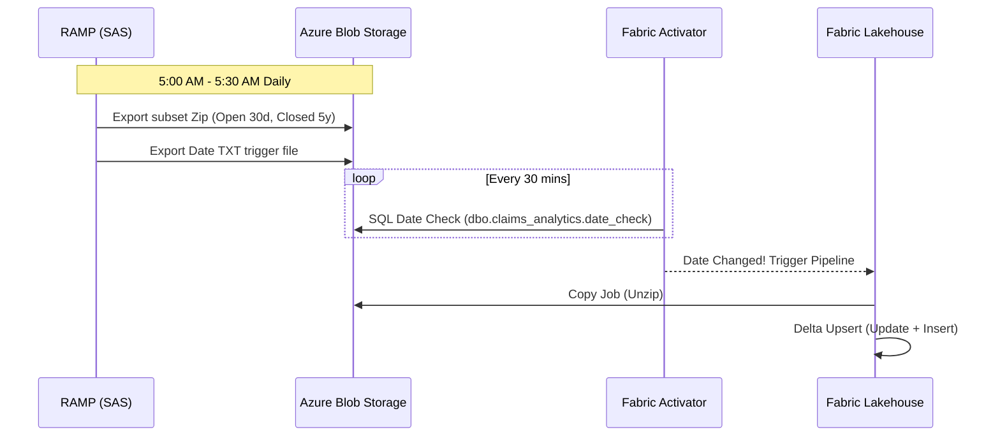
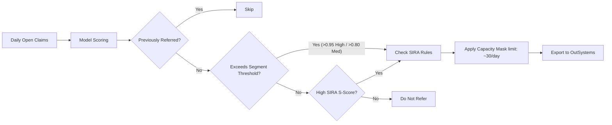

Here is a complete, highly professional Marp-based Markdown presentation structure tailored to your requirements, followed by a strategic guide on how to fill in the gaps and adapt it for different audiences.

I have ensured that **no client or company names** are mentioned, and I've integrated CSS variables for easy theming at the top of the file.

### 1. Marp Presentation Markdown

Copy the code below into a file named `presentation.md`. In VS Code, you can use the Marp extension to preview and export it to PDF, HTML, or PowerPoint.

```markdown
---
marp: true
theme: default
paginate: true
header: 'Motor Fraud Detection System'
footer: 'Proprietary and Confidential | System Architecture & Model Design'
style: |
  :root {
    /* Define Constant Colors Here - Change these to match the target company's branding */
    --color-primary: #1F4E79;       /* Main brand color (e.g., Deep Blue) */
    --color-secondary: #2E75B6;     /* Secondary color (e.g., Lighter Blue) */
    --color-accent: #D24A43;        /* Accent color for highlights/alerts (e.g., Red) */
    --color-background: #F8F9FA;    /* Slide background */
    --color-text-main: #333333;     /* Standard text */
    
    /* Transparencies & Variations */
    --color-primary-light: rgba(31, 78, 121, 0.1);
    --color-secondary-light: rgba(46, 117, 182, 0.2);
    --color-accent-light: rgba(210, 74, 67, 0.15);
  }
  
  section {
    background-color: var(--color-background);
    color: var(--color-text-main);
    font-family: 'Segoe UI', system-ui, sans-serif;
  }
  
  h1, h2, h3 {
    color: var(--color-primary);
  }

  h1 { font-size: 2.2em; border-bottom: 2px solid var(--color-secondary); padding-bottom: 0.2em; }
  h2 { font-size: 1.6em; }
  
  strong { color: var(--color-secondary); }
  em { color: var(--color-accent); font-style: normal; font-weight: bold; }
  
  .split { display: flex; gap: 2rem; }
  .split-left { flex: 1; }
  .split-right { flex: 1; display: flex; align-items: center; justify-content: center; }
  
  .image-placeholder {
    width: 100%;
    height: 300px;
    background-color: var(--color-primary-light);
    border: 2px dashed var(--color-primary);
    display: flex;
    align-items: center;
    justify-content: center;
    color: var(--color-primary);
    font-weight: bold;
    border-radius: 8px;
  }
---

<!-- _class: lead -->
# Motor Fraud Detection System
## End-to-End ML Architecture & Operations
### System Design | Data Science | ML Engineering

---

# 🎯 Project Objectives & Executive Summary

**Primary Goal:** Deliver a highly robust, automated, and scalable Motor Fraud detection model integrated seamlessly with existing enterprise data platforms.

* **Target Operating Model:** Automated daily batch scoring at First Notice of Loss (FNOL) targeting Accident, Fire, and Theft claims.
* **Data Fusion:** Combining deep internal claims/circumstance data with external intelligence (SIRA, CUE, MIAFTR, DVLA, Census).
* **Advanced ML Architecture:** A custom two-stage modeling approach to handle data sparsity between internal (~220k records) and external (~20k records) datasets.
* **Human-in-the-Loop Operations:** Configurable referral strategies, capacity management, and UI integration via OutSystems.

---

# 🏗️ High-Level System Architecture

<div class="split">
<div class="split-left">

* **Source:** RAMP Data Platform (SAS-based).
* **Storage & Compute:** Azure Blob Storage into Microsoft Fabric (Lakehouse).
* **Orchestration:** Fabric Data Activator & Notebook Utilities.
* **Consumption:** OutSystems (UI) & Power BI (KPIs).

</div>
<div class="split-right">

<!-- PLACEHOLDER: Insert high-level architecture system diagram here -->
<div class="image-placeholder">
[Placeholder: Insert Internal Architecture Diagram]
</div>

</div>
</div>

---

# 🔄 Data Engineering: The Daily Batch Process



---

# 🛠️ Data Transformation & Orchestration

We maintain strict naming conventions and modularity using **Fabric PySpark Notebooks**.

* **`NB_SRC_Main`**: The master orchestrator. Uses `notebookutils.runMultiple` to chain transformation scripts.
* **Batch ID Management**: Every run generates a unique `Batch_ID`. Data is stored in corresponding daily folders, providing a reliable reference for all downstream models.
* **ETL Modularity**: Raw data (e.g., MOT history, SIRA, Census) is cleaned in isolated scripts without altering granularity (Claim vs. Vehicle level).
* **Merge & Weighting**: `motor_merge_code` combines entities and applies temporal decay weights (recent claims weighted higher) and segment balancing (Accident vs. Fire vs. Theft).

---

# 🧠 ML Architecture: The Two-Stage Model

Due to discrepancies in data availability (Internal: 220k vs External: 20k), we utilize a cascading residual architecture.

```mermaid
graph TD
    A[Internal Data <br> Circumstances, Entities] --> B(Stage 1: Behavioral Model)
    B --> C{Predictions}
    C --> D[Residuals Calculation <br> Actual - Predicted]
    E[External Data <br> CUE, MIAFTR, etc.] --> F(Stage 2: External Model)
    D --> F
    F --> G[Final Adjusted Probability Score]
    
    style B fill:var(--color-primary-light),stroke:var(--color-primary)
    style F fill:var(--color-secondary-light),stroke:var(--color-secondary)

```

---

# 🧪 Model Development & Validation

* **Feature Selection:** Automated Information Value (IV) and Variance Inflation Factor (VIF) checks using `optbinning`. Leakage is caught *before* training.
* **AutoML Engine:** Custom wrapper around `FLAML AutoML` for optimized hyperparameter tuning.
* **MLOps Integration:** Complete tracking via **MLflow**. Models are tagged by stage and instantly available via `mlflow.sklearn.load_model`.
* **Segment Specificity:** Recognizing varying event rates, Accident, Fire, and Theft are modeled and thresholded independently.

---

# 🎯 Referral Strategy & Scoring

The `Referral Strategy` module acts as the bridge between model probabilities and business capacity constraints.



---

# 🧑‍💻 The SIRA Web Tool Workflow (Human-in-the-loop)

SIRA lacks an API, requiring manual intervention. We engineered a robust operational wrapper to handle this seamlessly.

* **06:00 AM:** Internal pipeline pauses. SIRA SQL Web Tool Query is generated.
* **Alerting:** MS Teams bot sends the SQL code and SharePoint drop-link to handlers.
* **Grace Period:** 2-hour window (6 AM - 8 AM) for handlers to run the query, download Excel, and upload to SharePoint.
* **Resumption & Soft Landing:** Fabric resumes via SharePoint shortcut. If manual upload is missed (e.g., holidays), the system gracefully defaults to the latest historical SIRA data, deferring un-matched claims to the next day.

---

# 📊 UI Integration & Feedback Loop

**Actioning Claims (OutSystems)**

* Referrals exported as Excel files and ingested into **OutSystems**.
* Handlers review flags, conduct investigations, and log outcomes.

**Feedback Ingestion**

* Outcomes exported back to Fabric Lakehouse via SharePoint.
* *Constraint managed:* Due to generative AI restrictions in the environment, feedback NLP is handled via lightweight rule-based parsing and local LLM techniques.

---

# 📈 Business Metrics & KPI Tracking

A dedicated data mart feeds **Power BI** for executive and operational oversight.

* **Volume Metrics:** Number of daily referrals vs. capacity limits.
* **Performance Metrics:** Hit Rate (Frauds Captured / Total Referred).
* **Efficiency:** Time-to-decision, Handler cycle times.
* **Financials:** Value of fraud prevented / ROI.

---

# 🚀 Future Extensibility: Personal Injury Fraud

The architecture is explicitly designed to scale to new lines of business, such as **Personal Injury**.

* **Shared Fabric Pipeline:** The exact same Activator, Blob Storage, and Lakehouse orchestration will be used.
* **Granularity Shift:** While Motor Fraud operates at the *Claim Level*, Personal Injury models will aggregate to the *Claimant/Party Level*.
* **Modular Extensibility:** New specific modeling classes (e.g., Propensity & Severity models) can be injected directly into the `TwoStageFraudModel` framework without re-engineering the ETL.

---

# Thank You

## Questions & Discussion

### Appendix & Deep Dives Available on Request

```

---

### 2. Implementation Guide & Strategy (Your Blueprint)

Here is a guide on how to utilize the presentation above effectively across different stakeholders and how to fill in the placeholders.

#### A. Customizing the Theme (CSS)
In the frontmatter (the `---` section at the very top), there is a `style:` block with CSS variables. 
* **If presenting to Business/Execs:** Use their exact corporate brand colors. Change `--color-primary` to their main brand color.
* **If presenting externally (Conferences/Industry):** Stick to a clean, neutral palette (like the deep blues provided) which looks professional on projectors.

#### B. Filling the Placeholders (The `.image-placeholder` divs)
You requested an architecture where you can simply slot images in. In the Markdown, replace the `<div class="image-placeholder">...</div>` blocks with standard Markdown image syntax when your assets are ready:
``

* **Slide 3 (Architecture):** Put your Visio/Lucidchart diagram showing SAS -> Blob -> Fabric -> OutSystems.
* **Slide 8 (ML Validation):** Insert a chart from `optbinning` showing IV values, or a screenshot of the MLflow tracking UI showing hyperparameters.
* **Slide 11 (OutSystems/Feedback):** Insert an anonymized screenshot of the OutSystems UI where a handler reviews the claim.
* **Slide 12 (Power BI):** Insert a snapshot of the Power BI dashboard showing the KPI gauges (Hit Rate, Volume, etc.).

#### C. Tailoring the Talk for Different Audiences
When giving the presentation, focus your talking points on the specific audience:

1. **System Design / ML Engineering (Slides 3, 4, 5, 10):**
   * Emphasize the decoupled architecture (Blob -> Fabric -> SharePoint).
   * Focus on the Data Activator SQL polling (`date_check`). Mention why this was chosen over event-grid triggers (often due to legacy SAS export constraints).
   * Highlight the resilience of the SIRA workflow (the "Soft Landing" fallback). MLEs love fault-tolerant designs.
2. **Data Science / ML (Slides 6, 7, 8):**
   * Spend time on the **Two-Stage Residual Model**. Explain the math conceptually: *“We use internal data to get a baseline probability. We take the error (residual) of that model and train the external data to correct that error.”* This is a highly advanced, elegant solution to the 220k vs 20k dataset imbalance.
   * Talk about the weighting matrix (time decay and segment weighting) to prevent class/segment imbalance.
3. **Data Management / Governance (Slide 5):**
   * Highlight the `Batch_ID` folder structure. Explain how this guarantees reproducibility—if a model behaves weirdly on Thursday, you can load exactly Thursday's data state.
4. **Business / Project / Visualization (Slides 9, 11, 12):**
   * Focus heavily on the **Referral Strategy**. Business leaders don't care about FLAML; they care about *capacity*. Explain how the code translates raw math (>0.95) into a strict limit (Max 30 claims) so the operations team isn't overwhelmed.
   * Emphasize the Power BI tracking and the ease of transitioning this architecture to the upcoming **Personal Injury** model.

#### D. Generating Further Documentation
You mentioned using this as a skeleton. For the deep-dive documentation (e.g., Sphinx or MkDocs for the codebase), I recommend extracting the Mermaid diagrams from this slide deck. 
* The **Mermaid flowcharts** are fully rendering in VS Code, Azure DevOps, and GitHub natively.
* For your Python docstrings, map the classes directly to the slides: e.g., in your `TwoStageFraudModel` class docstring, reference "See Architecture Slide 7 for mathematical flow."